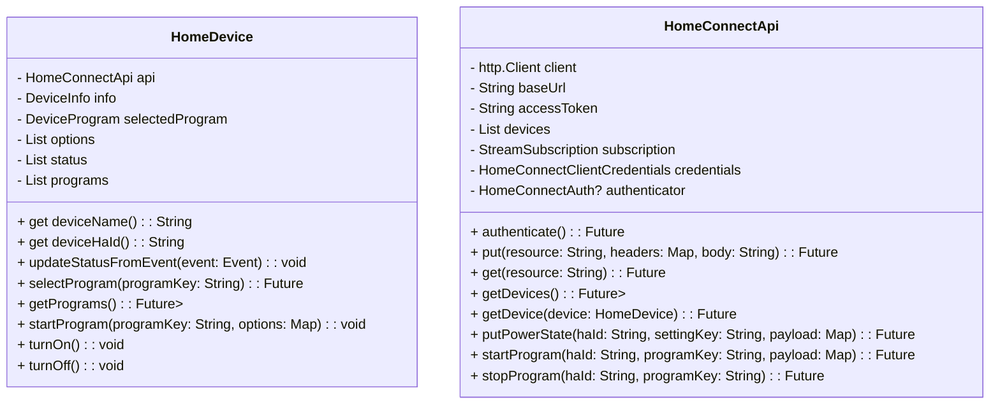

# Home Connect SDK
This library is a work in progress sdk for [Homme Connect](https://www.home-connect.com/us/en) api.

## Setup
- Get your account and access token from [here](https://api-docs.home-connect.com/quickstart?).
- Import the package in your flutter app.

## General overview

## Show all devices
- Get a list of all devices and their info, run `api.getDevices()`, this will return a list of HomdeDevices

## Select a specific device
- To select a device and its options you should run `api.getDevice(<device instance>)`, this will return a device of proper type. For example if the selected device was an oven, it will return an OvenDevice instance.

##  To get a device programs
- run `myDevice.getPrograms()` will return a list of programs.

## To select a progam
- run `myDevice.selectProgram(<program key>)` this will select the specified program and update the programs constrains and options.

## To start a program
- run `myDevice.startProgram(<haid>, <programKey>, <options map>)`
