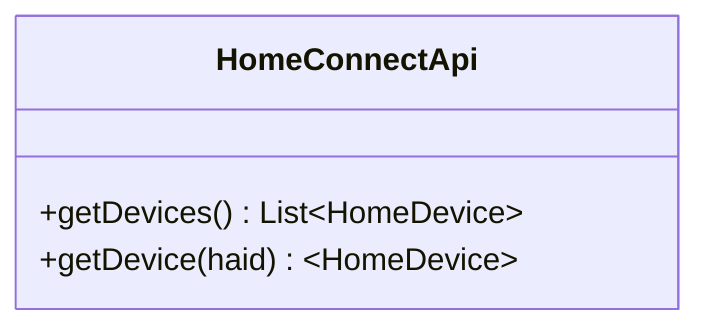
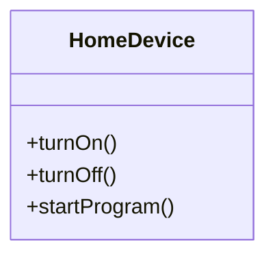

# Home Connect SDK
This library is a work in progress sdk for [Homme Connect](https://www.home-connect.com/us/en) api.


## Setup
- Get your account and access token from [here](https://api-docs.home-connect.com/quickstart?).
- Import the package in your flutter app.
> **Flutter**  Example:
```Dart 
class  DeviceState  extends  ChangeNotifier {
	HomeConnectApi  api  =  HomeConnectApi(
		'https://simulator.home-connect.com/api/homeappliances',
			// To use the simulator we only need the access token at this stage.
			accessToken:  accessToken,
			credentials:  HomeConnectClientCredentials(
			clientId:  'Your client id',
			clientSecret:  'Your client secret',
			redirectUri:  'https://example.com',
		),
	);
}
```
- Once the api is instantiated it exposes some methods for us:

- `getDevice` will give us a `HomeDevice` of its respective type. For example, the haid of an oven will return an `OvenDevice`. The `HomeDevice` class gives us access to device specific methods.




